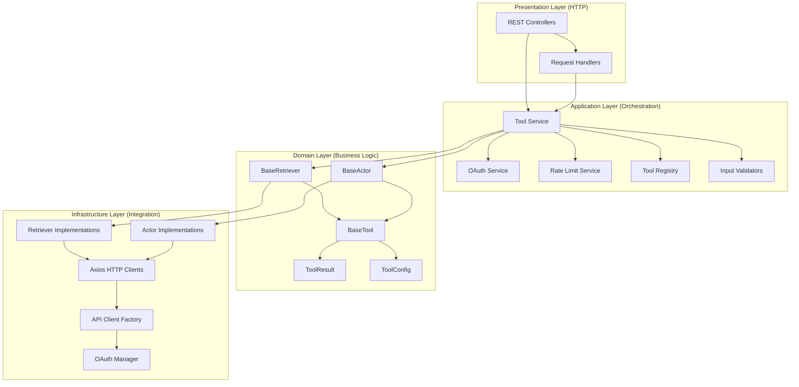
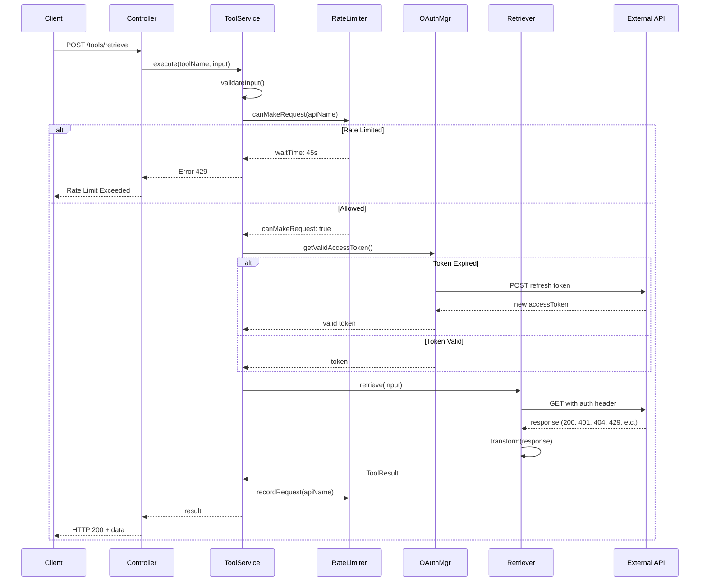

# Agent Tool Worker - Architecture Documentation

## Table of Contents

- [Overview](#overview)
- [Hexagonal Architecture](#hexagonal-architecture)
- [System Architecture](#system-architecture)
- [Component Organization](#component-organization)
- [Data Flow](#data-flow)
- [Tool Execution Flow](#tool-execution-flow)
- [API Integration Architecture](#api-integration-architecture)
- [Rate Limiting Architecture](#rate-limiting-architecture)

---

## Overview

The Agent Tool Worker implements **Hexagonal Architecture** (Ports & Adapters pattern) to enable clean separation of concerns, comprehensive testing, and easy integration with external systems. The system comprises three main layers:

1. **Domain Layer** - Pure business logic and tool definitions
2. **Application Layer** - Use cases, orchestration, and services
3. **Infrastructure Layer** - HTTP controllers, API adapters, and external integrations

**Key Architectural Goals:**
- ✅ Tool agnostic - Support any tool type (retriever, actor, etc.)
- ✅ API agnostic - Support multiple external APIs simultaneously
- ✅ Authentication agnostic - Support OAuth, API keys, Bearer tokens, Basic auth
- ✅ Testable - 100% unit test coverage with mocked dependencies
- ✅ Scalable - Rate limiting, caching, and distributed execution support

---

## Hexagonal Architecture



---

## System Architecture

### High-Level Component Diagram

```
┌─────────────────────────────────────────────────────────────────────┐
│                         Client Applications                          │
│                    (Web, Desktop, Mobile, API)                       │
└────────────────────────────────┬────────────────────────────────────┘
                                 │
                    ┌────────────▼────────────┐
                    │   REST API Controllers   │
                    │  - Tool Management       │
                    │  - Tool Execution        │
                    │  - OAuth Management      │
                    │  - Health/Metrics        │
                    └────────────┬────────────┘
                                 │
         ┌───────────────────────┼───────────────────────┐
         │                       │                       │
   ┌─────▼──────┐      ┌────────▼────────┐    ┌────────▼────────┐
   │Tool Service │      │OAuth Service    │    │RateLimit Service│
   │             │      │                 │    │                 │
   │ - Registry  │      │ - Auth Flows    │    │ - Quota Track   │
   │ - Executor  │      │ - Token Mgmt    │    │ - Wait Times    │
   │ - Validator │      │ - Refresh Logic │    │ - Sliding Window│
   └─────┬──────┘      └────────┬────────┘    └────────┬────────┘
         │                      │                      │
         ├──────────────────────┼──────────────────────┤
         │                      │                      │
   ┌─────▼──────────┐    ┌──────▼──────┐    ┌────────▼────────┐
   │ Tool Registry   │    │OAuth Manager │    │API Client Factory│
   │                 │    │              │    │                 │
   │ - Retrievers(8) │    │ - Token Mgmt │    │ - Auth Setup    │
   │ - Actors(6)     │    │ - Expiration │    │ - Retry Logic   │
   │ - Custom Tools  │    │ - Refresh    │    │ - Interceptors  │
   └─────┬──────────┘    └──────┬──────┘    └────────┬────────┘
         │                      │                    │
    ┌────┴──────────────────────┴────────────────────┴────┐
    │                                                     │
    │        External API Implementations                │
    │  ┌─────────────────────────────────────────┐      │
    │  │  Google Drive API v3                    │      │
    │  │  - File search and retrieval            │      │
    │  │  - Metadata extraction                  │      │
    │  │  - Pagination support                   │      │
    │  └─────────────────────────────────────────┘      │
    │  ┌─────────────────────────────────────────┐      │
    │  │  Notion API v1                          │      │
    │  │  - Database queries                     │      │
    │  │  - Page search                          │      │
    │  │  - Property extraction                  │      │
    │  └─────────────────────────────────────────┘      │
    │  ┌─────────────────────────────────────────┐      │
    │  │  Todoist REST API v2                    │      │
    │  │  - Task queries and filtering           │      │
    │  │  - Priority/status management           │      │
    │  │  - Sorting and pagination               │      │
    │  └─────────────────────────────────────────┘      │
    │  ┌─────────────────────────────────────────┐      │
    │  │  + 5 More External APIs                 │      │
    │  │  (YouTube, Weather, Tavily, etc.)      │      │
    │  └─────────────────────────────────────────┘      │
    │                                                    │
    └────────────────────────────────────────────────────┘
```

---

## Component Organization

### Directory Structure

```
agent-tool-worker/
├── src/
│   ├── domain/                          # Domain Layer
│   │   ├── tools/
│   │   │   ├── base.tool.ts            # Abstract BaseTool
│   │   │   ├── base.retriever.ts       # Abstract BaseRetriever
│   │   │   └── base.actor.ts           # Abstract BaseActor
│   │   ├── schemas/
│   │   │   ├── tool-input.schema.ts
│   │   │   └── tool-output.schema.ts
│   │   └── exceptions/
│   │       ├── tool-not-found.exception.ts
│   │       └── tool-execution.exception.ts
│   │
│   ├── application/                    # Application Layer
│   │   ├── services/
│   │   │   ├── tool.service.ts         # Main orchestration
│   │   │   ├── oauth.service.ts        # OAuth management
│   │   │   └── rate-limiting.service.ts
│   │   ├── controllers/
│   │   │   ├── tool.controller.ts
│   │   │   ├── oauth.controller.ts
│   │   │   └── health.controller.ts
│   │   └── dto/
│   │       ├── tool-execution.dto.ts
│   │       └── oauth.dto.ts
│   │
│   └── infrastructure/                 # Infrastructure Layer
│       ├── tools/
│       │   ├── retrievers/
│       │   │   ├── google-drive.retriever.ts
│       │   │   ├── notion.retriever.ts
│       │   │   ├── todoist.retriever.ts
│       │   │   ├── google-calendar.retriever.ts
│       │   │   ├── youtube.retriever.ts
│       │   │   ├── weather.retriever.ts
│       │   │   ├── tavily.retriever.ts
│       │   │   └── curl.retriever.ts
│       │   ├── actors/
│       │   │   ├── filesystem.actor.ts
│       │   │   ├── terminal.actor.ts
│       │   │   ├── http-request.actor.ts
│       │   │   ├── todo.actor.ts
│       │   │   ├── localdb.actor.ts
│       │   │   └── /* more actors */
│       │   └── registry/
│       │       └── tool.registry.ts
│       │
│       ├── integrations/
│       │   ├── api-integrations.module.ts
│       │   │   ├── OAuthManager
│       │   │   ├── ApiClientFactory
│       │   │   └── RateLimitService
│       │   ├── google/
│       │   │   ├── oauth.config.ts
│       │   │   └── scopes.ts
│       │   └── external-apis/
│       │       ├── notion.config.ts
│       │       ├── todoist.config.ts
│       │       └── /* api configs */
│       │
│       ├── services/
│       │   └── rate-limiting.service.ts
│       │
│       └── middleware/
│           ├── auth.middleware.ts
│           ├── rate-limit.middleware.ts
│           └── error-handler.middleware.ts
│
└── src/__tests__/
    ├── domain/
    │   ├── tools/*.spec.ts
    │   └── schemas/*.spec.ts
    ├── application/
    │   ├── services/*.spec.ts
    │   └── controllers/*.spec.ts
    └── infrastructure/
        ├── tools/retrievers/*.spec.ts
        ├── tools/actors/*.spec.ts
        └── services/*.spec.ts
```

---

## Data Flow

### Tool Execution Flow

```
1. HTTP Request
   POST /tools/google_drive_retriever/execute
   { input: {...}, credentials: {...} }
        │
        ▼
2. Tool Controller
   - Parse request
   - Extract tool name & input
   - Invoke ToolService
        │
        ▼
3. Tool Service
   - Validate input against schema
   - Check rate limits via RateLimitService
   - Lookup tool in registry
   - Prepare credentials (OAuth manager)
        │
        ▼
4. Rate Limiting Check
   canMakeRequest(apiName, quotaConfig)
   - Check per-second, minute, hour limits
   - Return wait time if exceeded
   - Allow or reject request
        │
        ▼ (if allowed)
5. OAuth Token Management
   - Check token expiration
   - Refresh if needed
   - Apply bearer token to request
        │
        ▼
6. Tool Execution
   - Invoke retrieve/execute method
   - Apply authentication interceptors
   - Set up retry logic (429, 503, 504)
   - Send HTTP request to external API
        │
        ▼
7. API Response
   - Receive data from external API
   - Parse response (success/error)
   - Handle errors (401, 403, 404, 429, etc.)
   - Transform to tool schema
        │
        ▼
8. Post-Execution
   - Record request in rate limiter
   - Cache response if applicable
   - Transform to ToolResult
   - Add metadata and timing
        │
        ▼
9. HTTP Response
   { success: true, data: {...}, executionTime: 234 }
```

---

## Tool Execution Flow

### Detailed Sequence Diagram



---

## API Integration Architecture

### Multi-API Authentication System

```
┌──────────────────────────────────────────────────────┐
│              API Client Factory                       │
│  - Creates axios instances with proper config        │
│  - Applies authentication interceptors               │
│  - Applies retry/backoff logic                       │
└──────────────────────────────────────────────────────┘
                      │
         ┌────────────┼────────────┐
         │            │            │
    ┌────▼────┐  ┌───▼────┐  ┌───▼────┐
    │ OAuth   │  │API Key  │  │Bearer  │
    │Manager  │  │Manager  │  │Manager │
    └────┬────┘  └───┬────┘  └───┬────┘
         │           │            │
    ┌────▼────────────┴────────────┴──────┐
    │                                      │
    │  Request Interceptor                 │
    │  - Add Authorization header          │
    │  - Add User-Agent                    │
    │  - Add request metadata              │
    └──────────┬───────────────────────────┘
               │
         ┌─────▼──────────────┐
         │ Retry Interceptor  │
         │ - 429: exponential │
         │ - 503: exponential │
         │ - 504: exponential │
         └─────┬──────────────┘
               │
         ┌─────▼──────────────┐
         │ Error Handler      │
         │ - Map HTTP codes   │
         │ - Transform errors │
         │ - Log failures     │
         └─────┬──────────────┘
               │
         ┌─────▼──────────────┐
         │ Response Handler   │
         │ - Parse response   │
         │ - Validate schema  │
         │ - Transform data   │
         └────────────────────┘
```

---

## Rate Limiting Architecture

### Sliding Window Algorithm

```
Time: ════════════════════════════════════════════
      0s  10s 20s 30s 40s 50s 60s (current time)
      │   │   │   │   │   │   │
      ●   ●   ●   ● ● ●   ●   ● (requests)

Per-Second Window (last 1 second):
  [59s ─────────────────────────────────── 60s]
  ●   (1 request in last second, limit=10, OK)

Per-Minute Window (last 60 seconds):
  [0s ───────────────────────────────────────── 60s]
  ●●●●●●●●  (8 requests in last minute, limit=300, OK)

Per-Hour Window (last 3600 seconds):
  [0h ──────────────────────────────────────────── 1h]
  ●●●●●●●●●●●●● (150 requests in last hour, limit=10000, OK)

Decision Logic:
  if (current_second <= limit_second)
     AND (current_minute <= limit_minute)
     AND (current_hour <= limit_hour)
     AND (current_burst <= limit_burst) {
    CAN_MAKE_REQUEST = true
  } else {
    CAN_MAKE_REQUEST = false
    WAIT_TIME = min_until_window_reset()
  }
```

### Rate Limit Quota Management

```
RateLimitService
├── requestTimestamps: Map<apiName, number[]>
│   ├── 'google_drive': [1729779599000, 1729779599100, ...]
│   ├── 'notion': [1729779600000, ...]
│   └── 'todoist': [...]
│
├── quotaResets: Map<apiName, QuotaReset[]>
│   ├── 'google_drive': [
│   │   { limit: 'daily', resetTime: 1729866000000 },
│   │   { limit: 'hourly', resetTime: 1729783200000 }
│   │ ]
│   └── ...
│
└── Methods:
    ├── canMakeRequest(apiName, quota)
    │   ├── cleanup timestamps > 3600s old
    │   ├── check per-second window
    │   ├── check per-minute window
    │   └── check per-hour window
    │
    ├── recordRequest(apiName)
    │   └── append current timestamp
    │
    ├── getStatus(apiName, quota)
    │   ├── count_last_second()
    │   ├── count_last_minute()
    │   └── count_last_hour()
    │
    └── getWaitTime(apiName, quota)
        └── return seconds until oldest request expires
```

---

## Module Dependencies

### Core Service Dependencies

```
┌─────────────────────────────────────────┐
│  ToolService (Main Orchestrator)        │
├─────────────────────────────────────────┤
│ Depends on:                             │
│ - ToolRegistry (lookup tools)           │
│ - RateLimitService (quota checks)       │
│ - OAuthService (credentials)            │
│ - InputValidator (schema validation)    │
│ - BaseRetriever/BaseActor (execution)   │
└─────────────────────────────────────────┘

┌─────────────────────────────────────────┐
│  RateLimitService                       │
├─────────────────────────────────────────┤
│ Depends on:                             │
│ - In-memory storage (Map<api, times>)   │
│ - Time utilities (current time)         │
│ - No external dependencies              │
└─────────────────────────────────────────┘

┌─────────────────────────────────────────┐
│  OAuthManager                           │
├─────────────────────────────────────────┤
│ Depends on:                             │
│ - axios (HTTP client)                   │
│ - OAuth provider URLs                   │
│ - Client ID/Secret                      │
│ - Token storage (in-memory)             │
└─────────────────────────────────────────┘

┌─────────────────────────────────────────┐
│  ApiClientFactory                       │
├─────────────────────────────────────────┤
│ Depends on:                             │
│ - axios (HTTP client)                   │
│ - OAuthManager (token refresh)          │
│ - Authentication config                 │
│ - Retry policy config                   │
└─────────────────────────────────────────┘

┌─────────────────────────────────────────┐
│  Individual Retrievers                  │
├─────────────────────────────────────────┤
│ Each retriever depends on:              │
│ - ApiClientFactory (preconfigured axio) │
│ - BaseRetriever (abstract class)        │
│ - External API configuration            │
│ - Input/Output schemas                  │
└─────────────────────────────────────────┘
```

---

## Testing Architecture

### Test Organization

```
src/__tests__/
├── domain/
│   └── tools/
│       ├── base.tool.spec.ts (50+ tests)
│       ├── base.retriever.spec.ts (40+ tests)
│       └── base.actor.spec.ts (45+ tests)
│
├── application/
│   └── services/
│       ├── tool.service.spec.ts (60+ tests)
│       ├── oauth.service.spec.ts (30+ tests)
│       └── rate-limiting.service.spec.ts (28+ tests)
│
└── infrastructure/
    ├── tools/
    │   ├── retrievers/
    │   │   ├── google-drive.retriever.spec.ts (14+ tests)
    │   │   ├── notion.retriever.spec.ts (18+ tests)
    │   │   ├── todoist.retriever.spec.ts (23+ tests)
    │   │   ├── google-calendar.retriever.spec.ts (14+ tests)
    │   │   ├── youtube.retriever.spec.ts (10+ tests)
    │   │   ├── weather.retriever.spec.ts (12+ tests)
    │   │   ├── tavily.retriever.spec.ts (12+ tests)
    │   │   └── curl.retriever.spec.ts (11+ tests)
    │   └── actors/
    │       ├── filesystem.actor.spec.ts (15+ tests)
    │       ├── terminal.actor.spec.ts (14+ tests)
    │       └── /* more actor tests */

Total Unit Tests: 375+
- Domain Layer Tests: 135+ tests
- Application Layer Tests: 118+ tests
- Infrastructure Layer Tests: 122+ tests
```

### Mock Strategy

- **HTTP Mocking:** jest.mock('axios') with complete response scenarios
- **OAuth Mocking:** Mock token refresh flows with expired/valid tokens
- **External APIs:** Mock all external API responses (success/error paths)
- **Database Mocking:** In-memory storage for testing
- **File System Mocking:** jest.mock('fs') for file operations

