# Assistant Worker - Architecture Documentation

## Table of Contents

- [Overview](#overview)
- [Hexagonal Architecture](#hexagonal-architecture)
- [System Architecture](#system-architecture)
- [Agent Execution Flow](#agent-execution-flow)
- [Data Flow](#data-flow)
- [Component Diagrams](#component-diagrams)
- [Layer Details](#layer-details)

---

## Overview

The Assistant Worker implements **Hexagonal Architecture** (Ports & Adapters pattern) to ensure clean separation of concerns, testability, and maintainability. The system is organized into three main layers:

1. **Domain Layer** - Pure business logic
2. **Application Layer** - Use cases and orchestration
3. **Infrastructure Layer** - External integrations

---

## Hexagonal Architecture

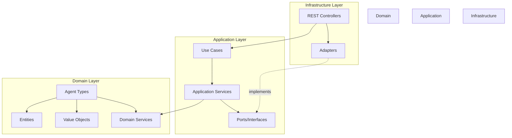

### Key Principles

1. **Dependencies point inward** - Infrastructure depends on Application, Application depends on Domain
2. **Domain is pure** - No external dependencies in domain layer
3. **Ports define contracts** - Application layer defines interfaces
4. **Adapters implement ports** - Infrastructure provides concrete implementations

---

## System Architecture

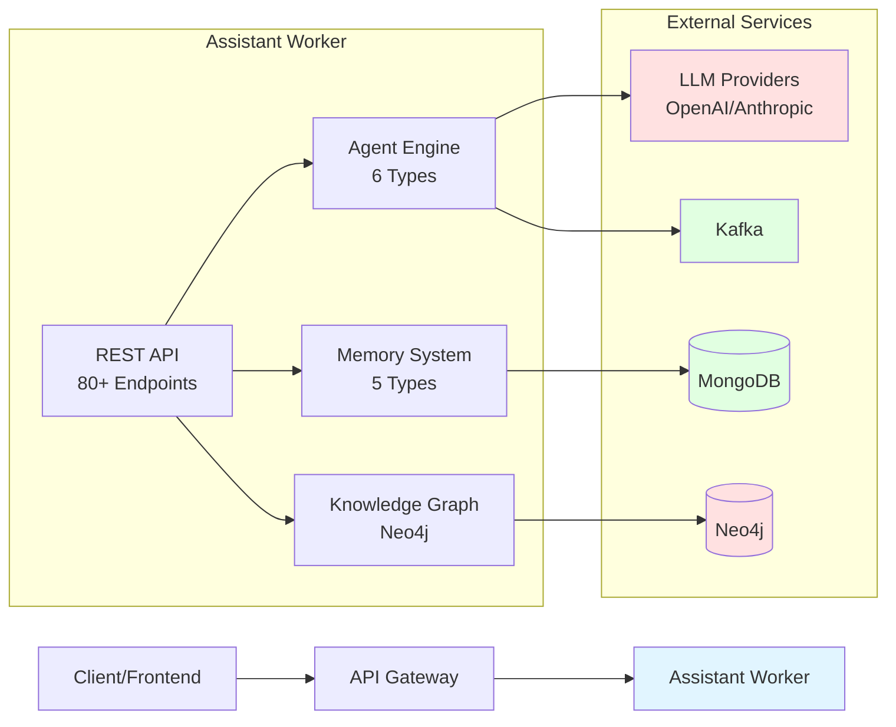

---

## Agent Execution Flow

### Standard Execution Flow

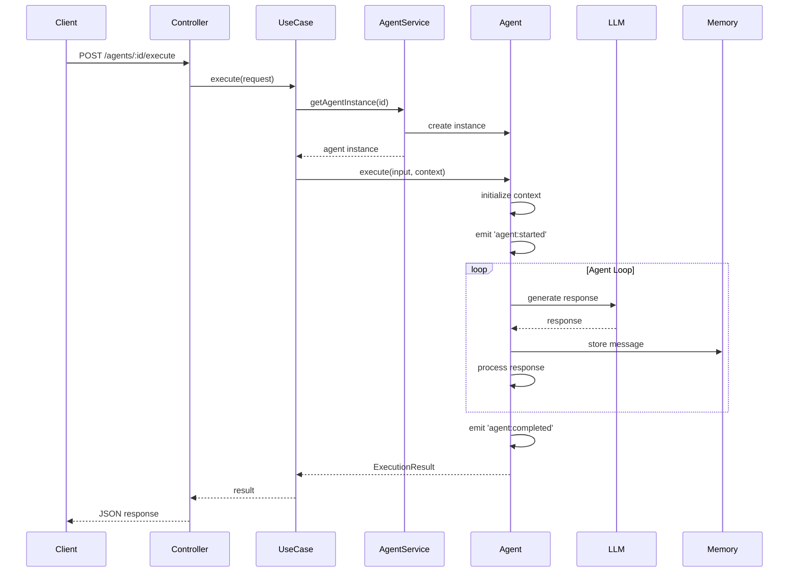

### Streaming Execution Flow

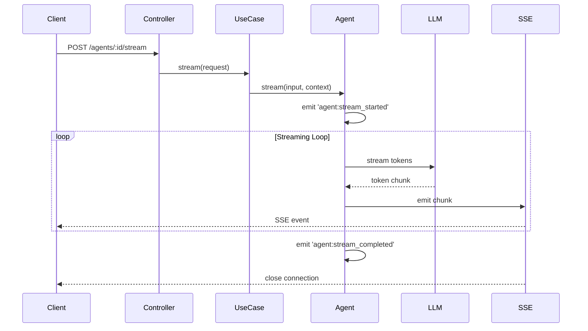

---

## Data Flow

### Agent Creation & Execution

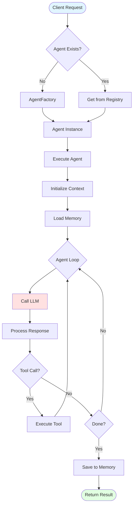

### Memory Operations

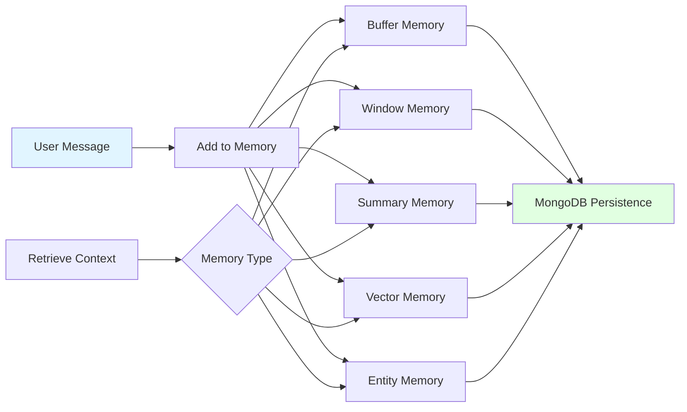

---

## Component Diagrams

### Domain Layer Components

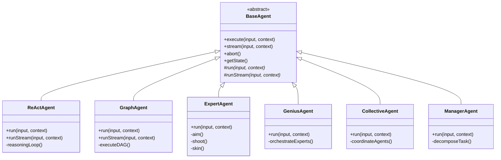

### Application Layer Components

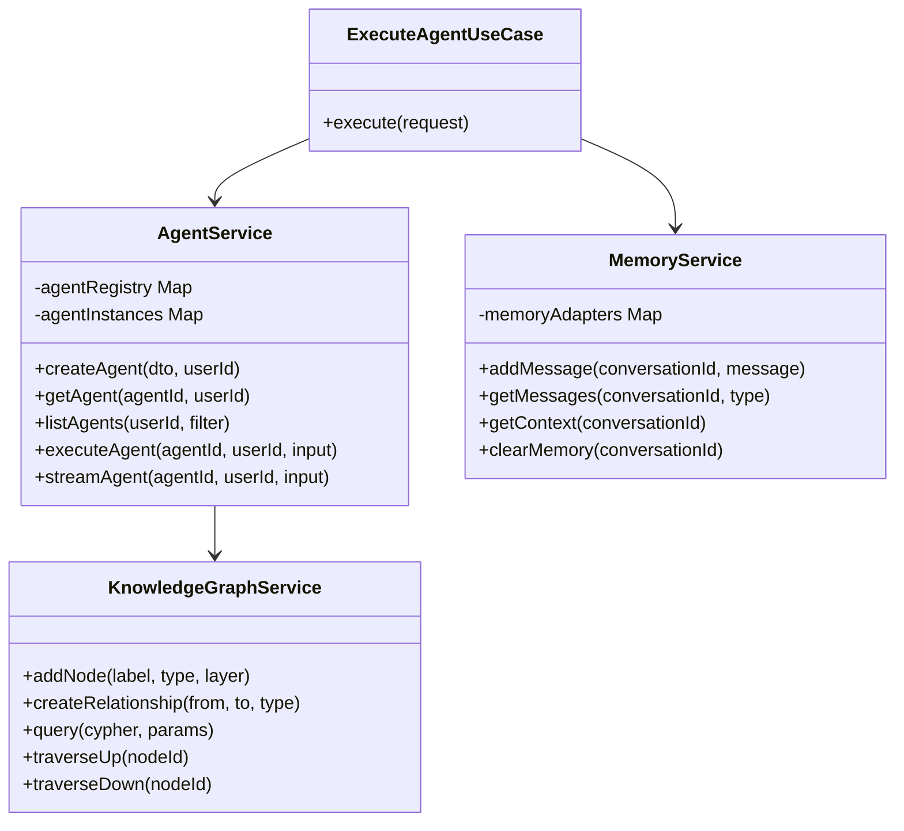

### Infrastructure Layer Components

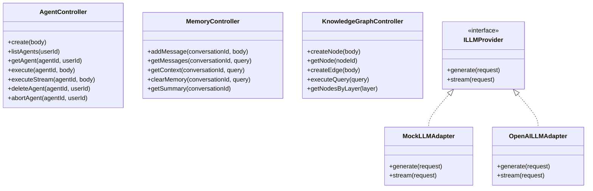

---

## Layer Details

### Domain Layer

**Location:** `src/domain/`

**Responsibilities:**
- Pure business logic
- Agent implementations
- Domain entities and value objects
- Domain services (PromptBuilder, ResponseParser, etc.)

**Key Files:**
```
domain/
├── agents/
│   ├── agent.base.ts          # Abstract base agent
│   ├── react-agent/           # ReAct agent
│   ├── graph-agent/           # Graph agent
│   ├── expert-agent/          # Expert agent
│   ├── genius-agent/          # Genius agent
│   ├── collective-agent/      # Collective agent
│   └── manager-agent/         # Manager agent
├── entities/
│   ├── agent.entity.ts        # Agent entity
│   ├── agent-state.entity.ts  # State management
│   └── execution-context.ts   # Execution context
├── value-objects/
│   ├── message.vo.ts          # Message value object
│   └── agent-config.vo.ts     # Configuration
└── services/
    ├── agent-factory.service.ts    # Creates agents
    ├── prompt-builder.service.ts   # Builds prompts
    └── response-parser.service.ts  # Parses responses
```

**No External Dependencies:** Domain layer only depends on TypeScript standard library.

---

### Application Layer

**Location:** `src/application/`

**Responsibilities:**
- Use case orchestration
- Application services
- Port definitions (interfaces)
- DTOs and validation

**Key Files:**
```
application/
├── use-cases/
│   ├── execute-agent.use-case.ts
│   └── stream-agent-execution.use-case.ts
├── services/
│   ├── agent.service.ts           # Agent CRUD
│   ├── memory.service.ts          # Memory operations
│   ├── knowledge-graph.service.ts # KG operations
│   ├── checkpoint.service.ts      # Checkpointing
│   └── hitl.service.ts           # Human-in-the-loop
├── ports/
│   ├── llm-provider.port.ts      # LLM interface
│   ├── logger.port.ts            # Logger interface
│   └── agent.repository.ts       # Repository interface
└── dto/
    ├── agent.dto.ts              # Agent DTOs
    └── execute-agent.request.ts  # Request DTOs
```

**Dependencies:** Domain layer only.

---

### Infrastructure Layer

**Location:** `src/infrastructure/`

**Responsibilities:**
- External integrations
- REST controllers
- Adapter implementations
- Middleware and filters

**Key Files:**
```
infrastructure/
├── controllers/
│   ├── agent.controller.ts           # 7 endpoints
│   ├── react-agent.controller.ts     # 5 endpoints
│   ├── graph-agent.controller.ts     # 8 endpoints
│   ├── expert-agent.controller.ts    # 6 endpoints
│   ├── genius-agent.controller.ts    # 7 endpoints
│   ├── collective-agent.controller.ts # 6 endpoints
│   ├── manager-agent.controller.ts   # 6 endpoints
│   ├── memory.controller.ts          # 11 endpoints
│   └── knowledge-graph.controller.ts # 15 endpoints
├── adapters/
│   ├── llm/
│   │   ├── mock-llm.adapter.ts
│   │   └── openai-llm.adapter.ts
│   ├── memory/
│   │   ├── buffer-memory.adapter.ts
│   │   ├── window-memory.adapter.ts
│   │   ├── summary-memory.adapter.ts
│   │   ├── vector-memory.adapter.ts
│   │   └── entity-memory.adapter.ts
│   ├── knowledge-graph/
│   │   └── neo4j.adapter.ts
│   └── streaming/
│       ├── sse-stream.adapter.ts
│       └── websocket.adapter.ts
└── middleware/
    ├── correlation-id.middleware.ts
    └── logging.interceptor.ts
```

**Dependencies:** Application and Domain layers.

---

## Agent Type Details

### ReAct Agent Architecture

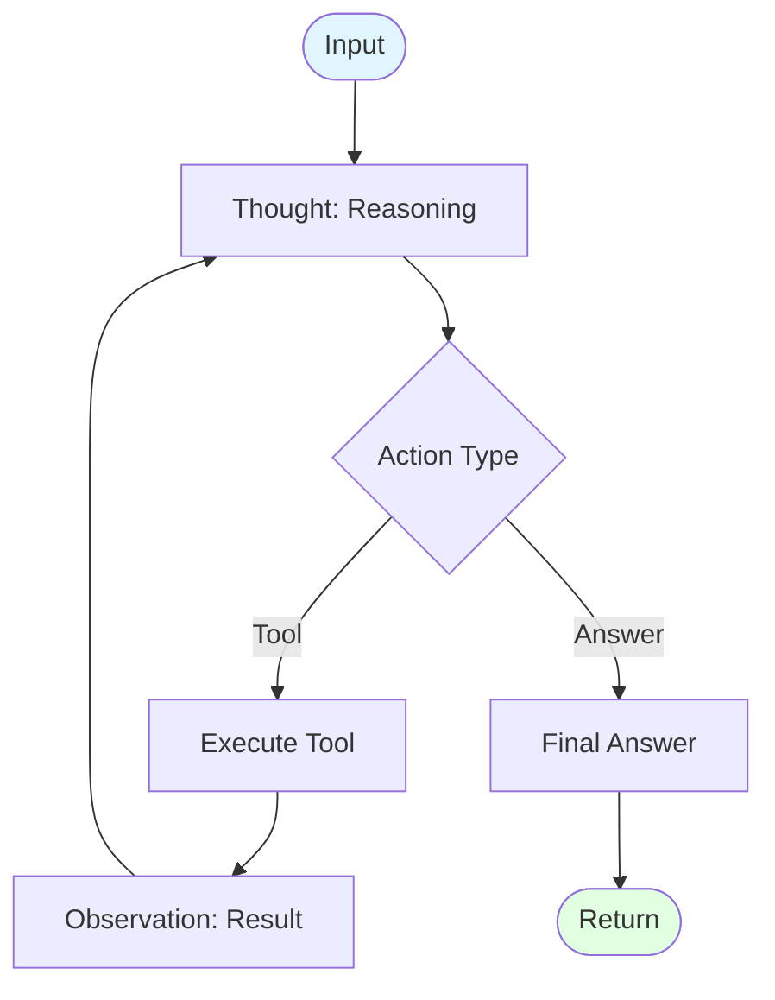

### Graph Agent Architecture

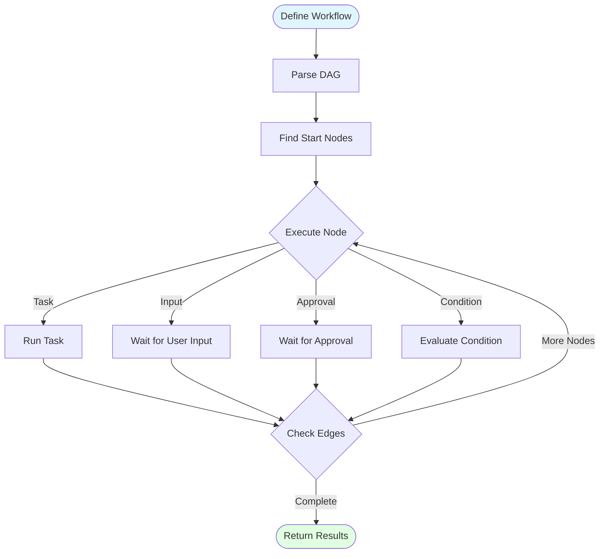

### Expert Agent Architecture (ICS)

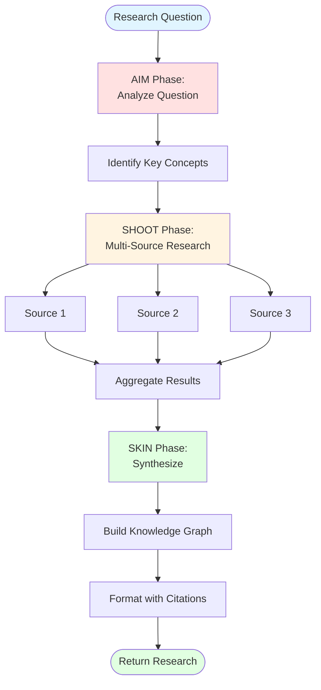

---

## Scaling Considerations

### Horizontal Scaling

The Assistant Worker is **stateless** and can be horizontally scaled:

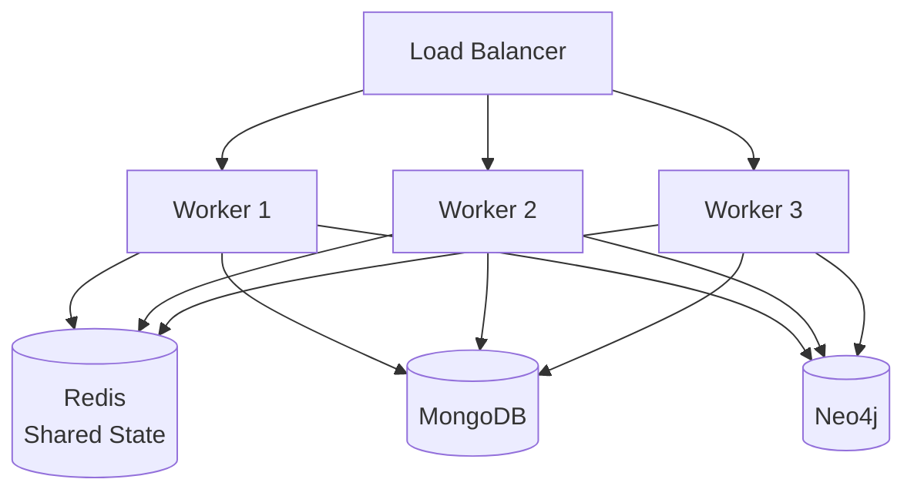

### Vertical Scaling

- Worker thread pool (2-8 threads)
- Memory limits configurable
- CPU allocation per pod/container

---

## Summary

The Assistant Worker architecture provides:

✅ **Clean Separation** - Hexagonal architecture ensures testability  
✅ **Extensibility** - Easy to add new agent types or adapters  
✅ **Scalability** - Stateless design enables horizontal scaling  
✅ **Maintainability** - Clear boundaries and dependencies  
✅ **Testability** - 98% test coverage with mock adapters  

For implementation details, see the source code in `src/`.

