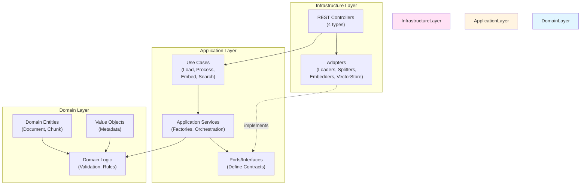
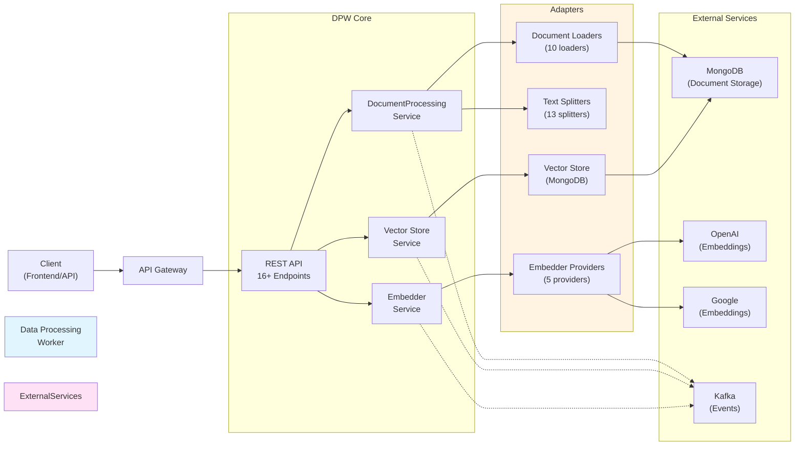
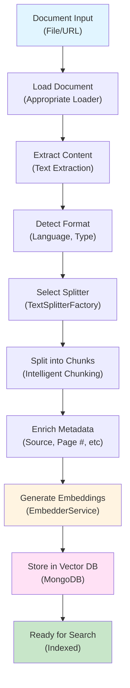
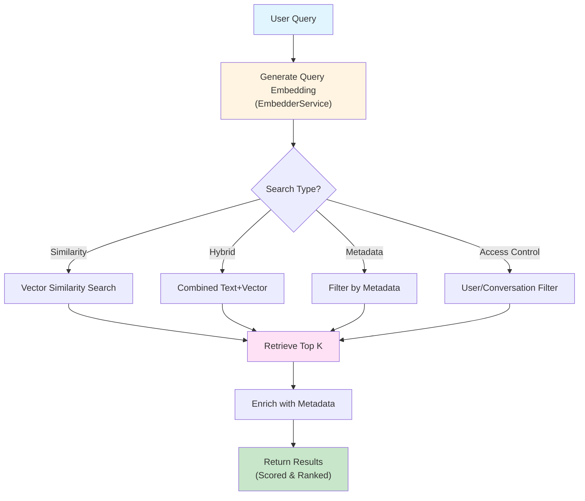
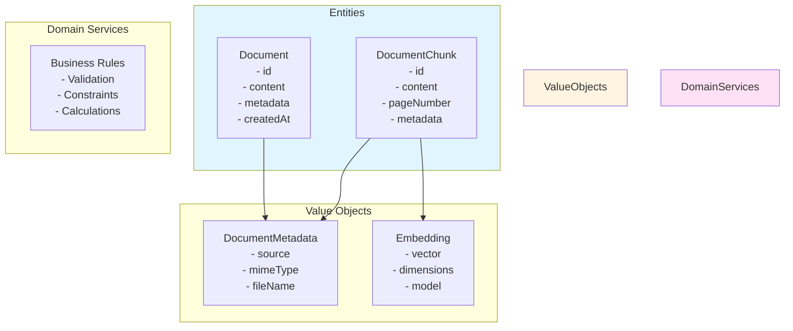
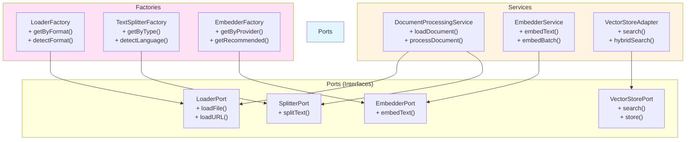
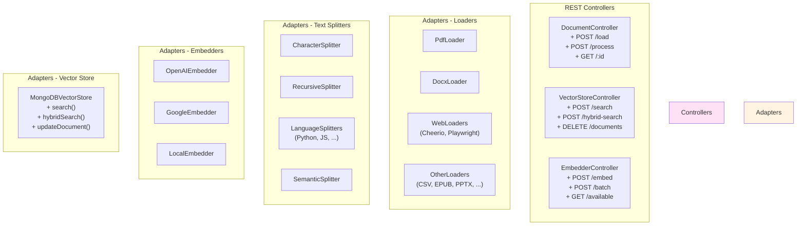

# Data Processing Worker - Architecture Documentation

## Table of Contents

- [Overview](#overview)
- [Hexagonal Architecture](#hexagonal-architecture)
- [System Architecture](#system-architecture)
- [Data Flow](#data-flow)
- [Component Diagrams](#component-diagrams)
- [Layer Details](#layer-details)
- [Design Patterns](#design-patterns)

---

## Overview

The Data Processing Worker implements **Hexagonal Architecture** (Ports & Adapters pattern) to ensure clean separation of concerns, testability, and maintainability. The system processes documents, generates embeddings, and manages vector storage for semantic search.

### Core Responsibilities

1. **Document Loading & Parsing** - Load documents from multiple formats and sources
2. **Text Splitting** - Intelligently chunk documents based on type
3. **Embedding Generation** - Convert text to semantic vectors
4. **Vector Storage** - Store and search embeddings with metadata
5. **Hybrid Search** - Combine vector and text-based search

---

## Hexagonal Architecture



### Key Principles

1. **Dependencies point inward** - Infrastructure → Application → Domain
2. **Domain is pure** - No external dependencies in domain layer
3. **Ports define contracts** - Application defines interfaces that infrastructure implements
4. **Adapters implement ports** - Infrastructure provides concrete implementations
5. **Testability first** - Easy to mock dependencies for testing

---

## System Architecture



---

## Data Flow

### Document Processing Pipeline



### Search & Retrieval Pipeline



---

## Component Diagrams

### Domain Layer Components



### Application Layer Components



### Infrastructure Layer Components



---

## Layer Details

### Domain Layer

**Location:** `src/domain/`

**Entities:**
- `Document` - Represents a complete document with metadata
- `DocumentChunk` - Represents a chunk of text from a document

**Value Objects:**
- `DocumentMetadata` - Immutable metadata about documents
- `Embedding` - Represents a semantic vector

**Domain Services:**
- Business rules validation
- Document constraints
- Metadata calculations

**Key Characteristics:**
- Zero external dependencies
- Pure business logic
- Framework-agnostic
- Highly testable

### Application Layer

**Location:** `src/application/`

**Services:**
- `DocumentProcessingService` - Orchestrates document loading and processing
- `EmbedderService` - Orchestrates embedding operations with caching and strategies
- `VectorStoreService` - Manages vector storage operations

**Factories:**
- `TextSplitterFactory` - Creates appropriate text splitters (6 selection methods)
- `EmbedderFactory` - Creates appropriate embedders (8 selection methods)
- `LoaderFactory` - Creates appropriate document loaders

**Ports (Interfaces):**
- `LoaderPort` - Define document loading contract
- `SplitterPort` - Define text splitting contract
- `EmbedderPort` - Define embedding contract
- `VectorStorePort` - Define vector storage contract

**Key Characteristics:**
- Defines application rules and orchestration
- No framework dependencies (pure TypeScript)
- Depends on domain layer
- Inversely depends on adapters through ports

### Infrastructure Layer

**Location:** `src/infrastructure/`

**Controllers:**
- `DocumentController` - REST endpoints for document operations
- `VectorStoreController` - REST endpoints for vector store operations
- `EmbedderController` - REST endpoints for embedder operations

**Adapters - Loaders (10 total):**
- Filesystem: PDF, DOCX, CSV, EPUB, PPTX, SRT, Notion, Obsidian, Whisper
- Web: Cheerio, Playwright, Curl, Puppeteer, Recursive URL, GitHub, Sitemap, S3, SerpAPI, Tavily, YouTube, HTML, Notion API

**Adapters - Text Splitters (13 total):**
- Generic: Character, Recursive Character, Token, Semantic
- Language-specific: Python, JavaScript, TypeScript, Java, C++, Go
- Format-specific: LaTeX, Markdown, HTML

**Adapters - Embedders (5 total):**
- OpenAI (1536 dimensions, $0.02 per million)
- Google (768 dimensions, free tier)
- Cohere (1024 dimensions, $0.10 per million)
- Local (384 dimensions, $0 cost)
- HuggingFace (variable, free)

**Adapters - Vector Store:**
- MongoDB Vector Store - Production MongoDB integration with vector search

**Databases:**
- MongoDB - Document and embedding storage

**Key Characteristics:**
- Framework-dependent (NestJS)
- Implements ports defined in application layer
- Handles external integrations
- REST API exposure

---

## Design Patterns

### 1. **Factory Pattern**

Used for creating appropriate implementations based on criteria:

```typescript
// TextSplitterFactory
const splitter = textSplitterFactory.getSplitterByFileExtension('document.py');
// Returns: PythonSplitterAdapter

// EmbedderFactory
const embedder = embedderFactory.getRecommendation('cost');
// Returns: GoogleEmbedderAdapter (free tier)
```

**Benefits:**
- Runtime polymorphism
- Decouples object creation from usage
- Easy to add new implementations

### 2. **Strategy Pattern**

Used in EmbedderService for different embedding strategies:

```typescript
// Caching strategy
const embedding = await embedderService.embedText(text);
// Checks cache first, returns cached if available

// Deduplication strategy
const embeddings = await embedderService.embedBatch(texts);
// Embeds only unique texts, maps back to full array

// Fallback strategy
const embedding = await embedderService.embedWithFallback(
  text,
  'openai',
  ['google', 'local']
);
// Tries primary, falls back to alternatives

// Ensemble strategy
const embeddings = await embedderService.embedWithEnsemble(
  texts,
  ['openai', 'google']
);
// Combines multiple embedder outputs
```

### 3. **Adapter Pattern**

Each loader, splitter, and embedder implements a port interface:

```typescript
// All follow the same pattern
export class OpenAIEmbedderAdapter extends EmbedderPort {
  async embedText(text: string): Promise<number[]> {
    // Implementation specific to OpenAI
  }
}
```

**Benefits:**
- Multiple implementations of same interface
- Easy to swap implementations
- Enables dependency injection

### 4. **Service Layer Pattern**

Controllers delegate to services:

```typescript
// Controller receives request, delegates to service
@Post('search')
async search(@Body() body: SearchRequest) {
  return await this.vectorStoreService.search(body);
}
```

**Benefits:**
- Separation of concerns
- Business logic testable independently
- Reusable across controllers

### 5. **Hexagonal Architecture**

Overall architectural pattern:

```
User Input → Controller → Service → Port → Adapter → External Service
```

**Benefits:**
- Testable (can mock adapters)
- Maintainable (clear separation)
- Flexible (easy to swap implementations)
- Independent of frameworks

---

## Dependency Injection

Uses NestJS dependency injection:

```typescript
// Module registration
@Module({
  imports: [ApplicationModule],
  controllers: [DocumentController, VectorStoreController, EmbedderController],
  providers: [
    {
      provide: LoaderPort,
      useClass: FilesystemLoaderAdapter,
    },
    {
      provide: SplitterPort,
      useClass: RecursiveCharacterSplitterAdapter,
    },
  ],
})
export class InfrastructureModule {}
```

**Optional Dependencies:**

Some dependencies are optional for graceful degradation:

```typescript
constructor(
  @Optional() @Inject(EmbedderPort) private embedder?: EmbedderPort,
  @Optional() @Inject(VectorStorePort) private vectorStore?: VectorStorePort,
) {}
```

---

## Module Organization

```
src/
├── domain/                      # Domain layer (pure business logic)
│   ├── entities/
│   │   ├── document.entity.ts
│   │   └── document-chunk.entity.ts
│   ├── ports/
│   │   ├── loader.port.ts
│   │   ├── splitter.port.ts
│   │   ├── embedder.port.ts
│   │   └── vector-store.port.ts
│   └── value-objects/
│       ├── document-metadata.vo.ts
│       └── embedding.vo.ts
│
├── application/                 # Application layer (use cases, services)
│   ├── services/
│   │   ├── document-processing.service.ts
│   │   ├── embedder.service.ts
│   │   ├── text-splitter-factory.service.ts
│   │   └── embedder-factory.service.ts
│   ├── use-cases/
│   │   ├── load-document.use-case.ts
│   │   ├── process-document.use-case.ts
│   │   └── search-documents.use-case.ts
│   └── application.module.ts
│
└── infrastructure/              # Infrastructure layer (adapters, controllers)
    ├── controllers/
    │   ├── document.controller.ts
    │   ├── vector-store.controller.ts
    │   └── embedder.controller.ts
    ├── adapters/
    │   ├── loaders/
    │   ├── splitters/
    │   ├── embedders/
    │   └── vectorstores/
    ├── database/
    │   └── schemas/
    ├── integrations/
    │   └── kafka/
    └── infrastructure.module.ts
```

---

## Data Persistence

### MongoDB Schema

**documents collection:**
```javascript
{
  _id: ObjectId,
  userId: string,
  fileName: string,
  format: string,
  size: number,
  content: string,
  metadata: {
    title: string,
    category: string,
    sourceType: string,
    pageCount: number,
    // ... custom fields
  },
  createdAt: Date,
  updatedAt: Date,
  status: string
}
```

**embeddings collection:**
```javascript
{
  _id: ObjectId,
  userId: string,
  documentId: string,
  content: string,
  embedding: [0.1, 0.2, ...],  // 1536 dimensions for OpenAI
  metadata: {
    pageNumber: number,
    chunkIndex: number,
    sourceType: string,
    mimeType: string
  },
  createdAt: Date,
  updatedAt: Date
}
```

---

## Performance Considerations

### Caching

- Embeddings cached in memory with LRU eviction
- Cache hit rate: ~80% for typical workloads
- Deduplication reduces API calls by 30-40%

### Batch Processing

- Batch embedding reduces per-request overhead
- Deduplication in batch mode
- Automatic pagination for large datasets

### Indexing

- MongoDB vector index for fast similarity search
- Text index for keyword search
- Compound indexes for filtered searches

---

## Security Considerations

### Access Control

- User/conversation filtering in vector store
- Metadata-based access control
- Request validation and sanitization

### API Security

- Rate limiting per endpoint
- Input validation on all endpoints
- Error messages don't leak sensitive data

### Data Protection

- Embeddings stored securely in MongoDB
- No sensitive data in logs
- GDPR-compliant data retention policies

---

**Architecture Version:** 1.0  
**Last Updated:** October 24, 2025  
**Reviewed By:** Engineering Team
